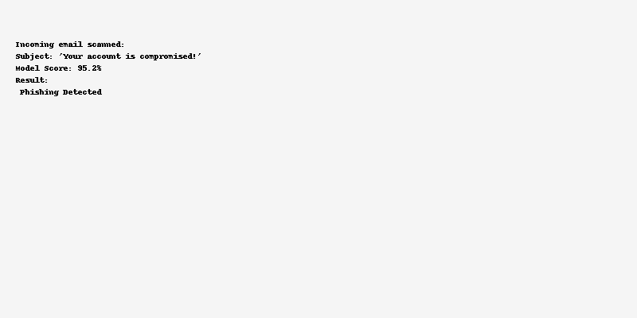
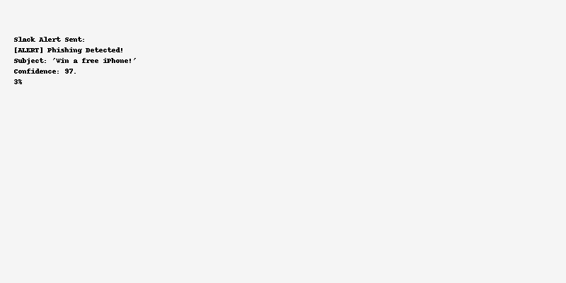
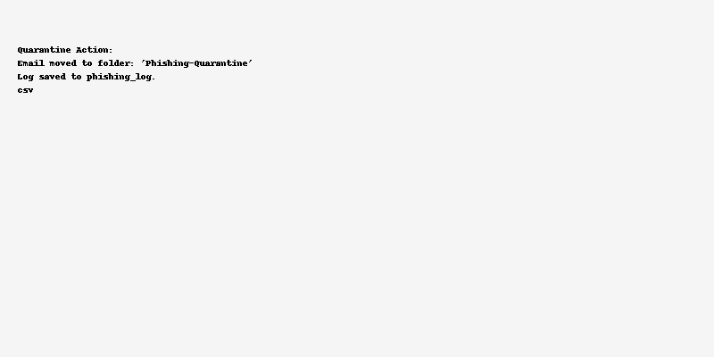

# 🤖 AI-Powered Phishing Email Classifier & Response Automation (APECRA)

This project simulates a real-world SOC tool that uses Natural Language Processing (NLP) and automation to **detect phishing emails** and **automate incident response**. Built with Python, Scikit-learn, Gmail API, and Slack Webhooks, this project helps you showcase both **cybersecurity** and **AI/ML** capabilities in your portfolio.

---


---

## 🔍 Use Case

Phishing remains one of the most common cyberattack vectors. Manual detection is time-consuming and error-prone. This system:
- Scans incoming emails in real-time using a trained AI model.
- Detects phishing attempts based on email content.
- Sends alerts via Slack or flags emails.
- Stores logs in a database or CSV for tracking.

---

## 🧱 Architecture Overview

1. **Email Ingestion** via Gmail or Outlook API.
2. **Preprocessing** with NLP (tokenization, TF-IDF, etc.).
3. **Classification** using a trained ML model.
4. **Incident Handling**:
   - Auto-move flagged emails to a quarantine folder.
   - Send alerts to SOC team via Slack.
   - Log incident with confidence score.

---

## 💡 Key Features

- ✅ Real-time phishing email detection
- ✅ Pretrained model using Scikit-learn
- ✅ Gmail API integration (can be swapped with Outlook)
- ✅ Slack notification for alerting
- ✅ Logs phishing attempts with timestamp, score
- ✅ Simple API key config file

---

## 🛠️ Tech Stack

| Category         | Tool/Service                   |
|------------------|-------------------------------|
| Programming      | Python                         |
| ML & NLP         | Scikit-learn, NLTK, Pandas     |
| Email API        | Gmail API / Microsoft Graph API|
| Alerting         | Slack Webhook / Email          |
| Automation       | Python Scripts, CRON (Optional)|
| Optional Add-on  | VirusTotal API for URL scoring |

---

## 🗂️ Project Structure

```
AI-Phishing-Detector/
├── model/                     # Trained classifier
│   └── phishing_classifier.pkl
├── data/                      # Dataset
│   └── phishing_dataset.csv
├── scripts/
│   ├── train_model.py         # Model training pipeline
│   ├── classify_email.py      # Classify incoming email
│   ├── email_listener.py      # Gmail API integration
│   └── respond_to_threat.py   # Slack alert + quarantine logic
├── config/
│   └── api_keys.json          # API tokens & config
├── requirements.txt           # Dependencies
├── README.md                  # Documentation
└── architecture.png           # System architecture diagram
```

---

## 🚀 Getting Started

### 1. Clone the Repo

```bash
git clone https://github.com/yourusername/AI-Phishing-Detector.git
cd AI-Phishing-Detector
```

### 2. Install Dependencies

```bash
pip install -r requirements.txt
```

### 3. Train the Model

```bash
python scripts/train_model.py
```

### 4. Run the Email Listener

```bash
python scripts/email_listener.py
```

### 5. Classify Emails and Respond

```bash
python scripts/classify_email.py
```

---

## 🧠 Model Training

The `train_model.py` script uses a TF-IDF vectorizer and logistic regression model to classify emails into:
- `1` = Phishing
- `0` = Safe

You can improve the model by adding more datasets or trying deep learning (e.g., BERT).

---

## 📸 Execution Screenshots

### ✅ Email Classification Output


### 📣 Slack Alert Example


### 📂 Quarantine Action Log


---

## 📈 Future Enhancements

- 🔍 Integrate VirusTotal to enrich email links
- 🔁 Add support for MS Outlook or Office365 Graph API
- 🔐 Add 2FA OTP or CAPTCHA detection
- 🧠 Upgrade to BERT or LLM for smarter predictions

---

## 👨‍💼 Ideal For

- Cybersecurity Engineer Portfolio
- Cloud Security Analyst Project
- AI + Security Integration Showcases
- SOC L1-L2 Hands-on Demonstration
- GitHub Profile with ML/Security Projects

---

## 📜 License

MIT License

---

## 🙋‍♀️ Want to Connect?

Feel free to connect with me on [LinkedIn](https://www.linkedin.com/in/sanjana9999) or ask questions via GitHub Issues!
